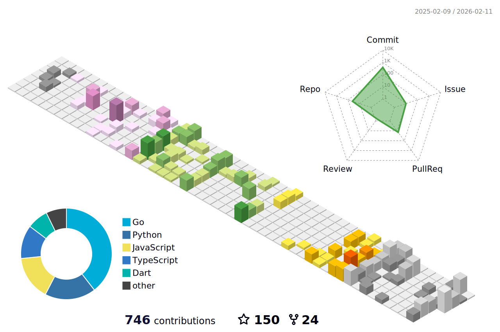

### 💻 技术栈 | Tech Stack

### 📊 GitHub 统计 | GitHub Stats

    
    
    

<picture>
    <source media="(prefers-color-scheme: dark)" srcset="https://raw.githubusercontent.com/WavesMan/WavesMan/output/github-contribution-grid-snake-dark.svg" />
    <source media="(prefers-color-scheme: light)" srcset="https://raw.githubusercontent.com/WavesMan/WavesMan/output/github-contribution-grid-snake.svg" />
</picture>

### 📈 活跃趋势

<picture>
  <source media="(prefers-color-scheme: dark)"  srcset="./profile-3d-contrib/profile-night-rainbow.svg" />
  <source media="(prefers-color-scheme: light)" srcset="./profile-3d-contrib/profile-season-animate.svg" />
  
</picture>

### 📬 联系方式 | Contact

