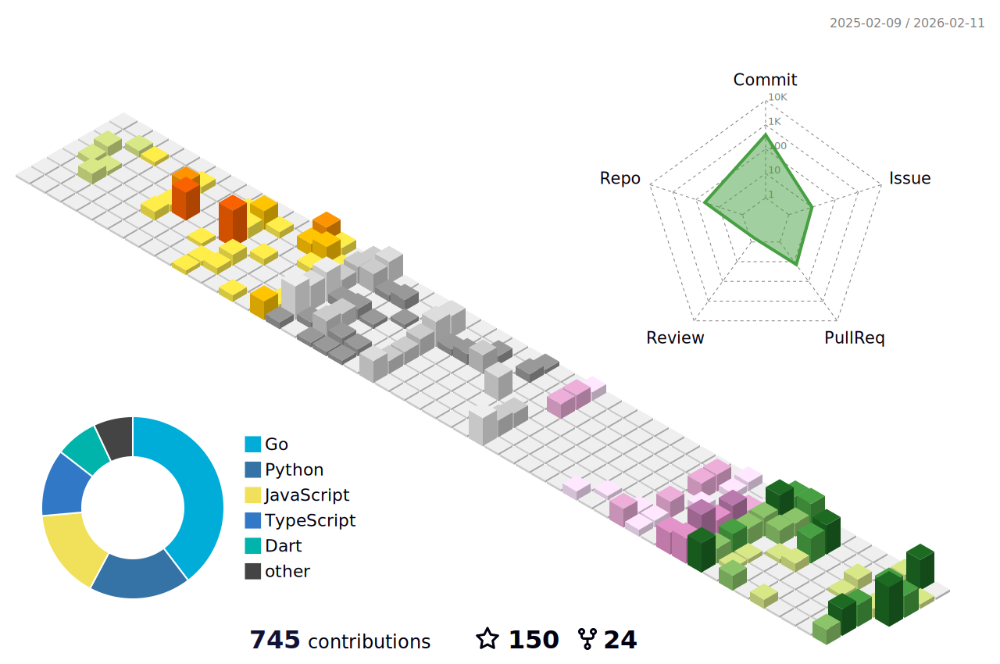

  

    尘寰寒彻，遂就流光之烬，更造春秋
  

### 💻 技术栈 | Tech Stack

                 

### ☁️ 云&网络 | Cloud & Network

 
 
 
 
 

### 📊 GitHub 统计 | GitHub Stats

  
  
  <picture>
    <source media="(prefers-color-scheme: dark)" srcset="https://github-readme-streak-stats.herokuapp.com/?user=WavesMan&theme=dark&hide_border=true&ring=FFB6C1&fire=FFB6C1&currStreakLabel=FFB6C1" />
    <source media="(prefers-color-scheme: light)" srcset="https://github-readme-streak-stats.herokuapp.com/?user=WavesMan&theme=default&hide_border=true&ring=FFB6C1&fire=FFB6C1&currStreakLabel=FFB6C1" />
    
  </picture>

  
📈 活跃趋势

  

    <picture>
      <source media="(prefers-color-scheme: dark)" srcset="./profile-3d-contrib/profile-night-green.svg" />
      <source media="(prefers-color-scheme: light)" srcset="./profile-3d-contrib/profile-south-season-animate.svg" />
      
    </picture>
  

### 📬 联系方式 | Contact

