<!-- 

 -->

## 💻 技术栈 | Tech Stack

## 📊 GitHub 统计 | GitHub Stats

    
    
    

 

<picture>
    <source media="(prefers-color-scheme: dark)" srcset="https://raw.githubusercontent.com/WavesMan/WavesMan/output/github-contribution-grid-snake-dark.svg" />
    <source media="(prefers-color-scheme: light)" srcset="https://raw.githubusercontent.com/WavesMan/WavesMan/output/github-contribution-grid-snake.svg" />
    
  
</picture>

 

## 📈 活跃趋势

## 📬 联系方式 | Contact

<strong>🌟 一起在代码的世界里创造小小奇迹！🌟</strong> 
轻轻记录来过这个世界的足迹～

## 鱿鱼丝统计 (Metrics)

